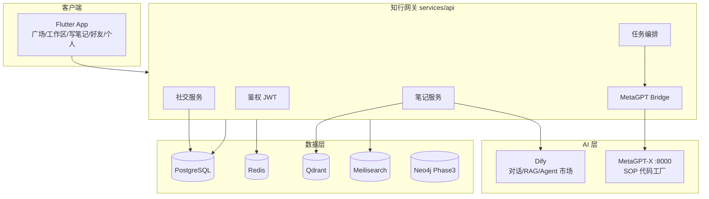

# 知行 — 系统架构

## 逻辑分层



## 模块映射（视频 Demo → 服务）

| Demo 模块 | 实现组件 | Phase |
|-----------|----------|-------|
| AI 对话「林」 | Dify App + 知行 API 代理 | P1 |
| 工作区文件树 | PostgreSQL + 对象存储 + 导出 API | P1 |
| 多视图笔记 | Flutter + tldraw WebView + Markdown | P1 |
| 布置任务/工作流 | 知行 Tasks → MetaGPT-X SOP | P1 |
| 可视化节点编辑 | React Flow WebView | P2 |
| 插件/Agent 市场 | Dify 工具 + 知行 market 表 | P2 |
| 好友/群聊 | OpenIM SDK | P2 |
| 广场/辩论 | Meili + 自定义投票 API | P2 |
| 知识图谱 | Neo4j + sigma WebView | P3 |
| 电商 | Medusa | P4 |
| AI 小程序 | Dify Workflow + e2b 沙箱 | P3 |

## MetaGPT-X 集成契约

### 触发编码任务

```http
POST http://127.0.0.1:8000/api/v1/projects/sop
Content-Type: application/json

{
  "name": "battery-notes-review",
  "idea": "分析本周电池笔记，整理 3 个研究问题。技术栈：Python FastAPI + Markdown 导出。",
  "auto_approve": true,
  "skip_dev": false
}
```

### 轮询 / 推送

- `GET /api/v1/projects/{id}` — 状态
- `WS /api/v1/projects/{id}/ws` — 日志流
- `GET /api/v1/queue` — 排队位置

### 知行侧封装

`services/metagpt-bridge/client.py` 提供：

- `submit_sop_task(name, idea, context_files[])`
- `get_task_status(job_id)`
- `stream_logs(job_id)` → 写入工作区「任务复盘」文件夹

### 上下文注入

用户在工作区选中笔记/PDF → 知行 API 打包为 `spec.md` 片段 →  prepend 到 MetaGPT `idea` 或写入 `G:\MetaGPT\projects\{name}\specs\001-mvp\spec.md` 后 `skip_dev=false`。

## 数据模型（核心表）

- `users` — 用户/等级/标签
- `notes` — 块 JSON + 模板类型（document/dual/canvas/mindmap）
- `workspace_folders` — 树形：作品集/小程序/工作流/skills/对话
- `conversations` — AI 对话元数据（正文在 Dify）
- `tasks` — 布置任务（priority, workflow_type, metagpt_job_id）
- `social_posts` — 广场内容
- `debates` — 结构化辩论（正/反、理由必填）

## 部署拓扑（本地开发）

```yaml
# infra/docker-compose.yml
services:
  postgres: ...
  redis: ...
  qdrant: ...
  meilisearch: ...
  dify-api: ...      # vendor/dify
  dify-web: ...
# MetaGPT-X 宿主机运行（需 LLM API Key）
# 知行 API 宿主机 :8080
# Flutter dev
```

## 安全边界

- MetaGPT 执行 shell/写文件 — 仅服务端，不对移动端暴露
- 用户「AI 小程序」— e2b 沙箱（Phase 3）
- Dify API Key 仅存服务端
